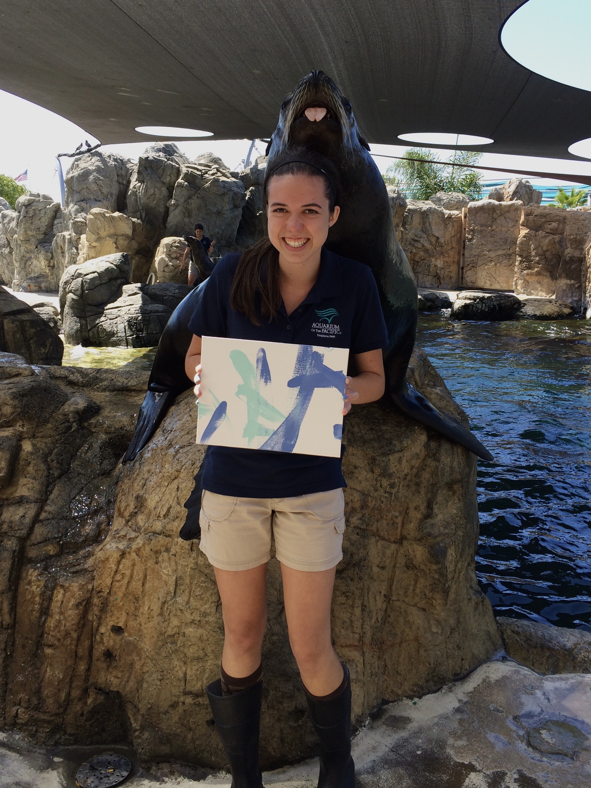

```{r setup, include=FALSE}
knitr::opts_chunk$set(echo = FALSE)
```

My passion for marine life has been present since I was a little girl, playing and exploring along the coasts of my home in Southern California, my grandparents’ place in the Caribbean, and my father’s homeland of Denmark. The life and vegetation of the sea captivated me, and I became fascinated with marine ecology. My extracurricular time was spent participating in activities that supported environmental exploration and conservation, including beach cleanups, a shark census, and the collection of eggs and release of sea turtle hatchlings. These experiences further bolstered my desire to learn more about the ocean and led to my eventual educational and career selection of environmental science.



During my undergraduate career, I was a marine mammalogy intern at the Aquarium of the Pacific, learning the proper nutrition and training required to care for seals, sea lions, and sea otters. I also worked as an NSF-funded REU student at the Duke University Marine Laboratory, conducting research on the effects of water salinity and chemical cues on the molting of fiddler crab larvae. 


After graduating from the University of San Diego, I was employed as a Tidepool Educator for the Laguna Ocean Foundation, where I monitored and protected the tidepools within Laguna Beach’s marine protected areas and provided tidepool education to the public. In my spare time, I volunteered with OC Habitats, a non-profit environmental organization in Orange County, collecting bimonthly shorebird field surveys, hosting beach clean-up events, and conducting educational outreach for elementary schools. Before starting my master's program at the UCSB Bren School, I also served as a Scientific Aid for the California Department of Fish and Wildlife for the Upper Newport Bay Ecological Reserve, carrying out habitat and trail restoration as well as California least tern chick monitoring.


At the Bren School, I plan to specialize in Coastal Marine Resources Management and Conservation Planning. I am excited to continue pursuing my passion for marine life and ecosystems and am eager to learn more about the effects of climate change and plastic pollution on various environments. 

